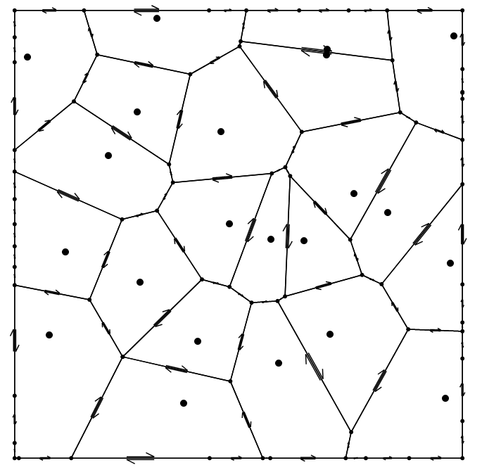

Computational geometric algorithms
circa 2019

Convex Hull:
Finds convex hull of a set of points using the gift-wrapping algorithm

Voronoi:
Implements a doubly-connected edge-list data structure.
Uses it to implement an interactive voronoi diagram (click to add a new vor. site)

Instructions:
Requires node
Tested and working with node version >= 6

    npm install
    nmp run serve : starts an interactive test server

    npm run test : runs tests

There's constants scattered throughout the code as well
//TODO: document those
